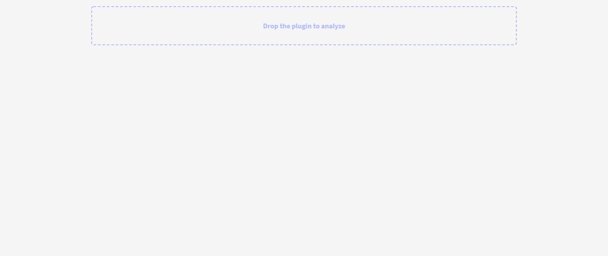
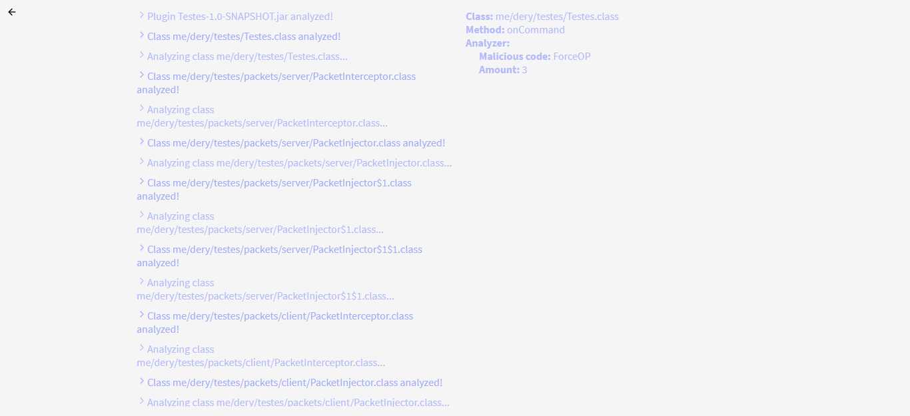

# Spigot Malicious Code Finder
A simple web app built on React that checks for malicious code in [Spigot](https://www.spigotmc.org/) plugins

# Code checks
- [x] ForceOP

Do you have more ideas of malicious code? Send me a dm on Discord **(Dery#2395)**!

# Images
Index | Analyzer
----- | --------
 | 

# Notes
This is my first react app. Must contain bad codes.

# Credits
Me

I would also like to thank LeonardoSNT for his incredible [project](https://github.com/leonardosnt/java-class-tools) that allows to manipulate JVM bytecode directly in the browser and for his other [project](https://github.com/leonardosnt/jar-string-editor) that allows to change Strings in jar files (this served as my basis)